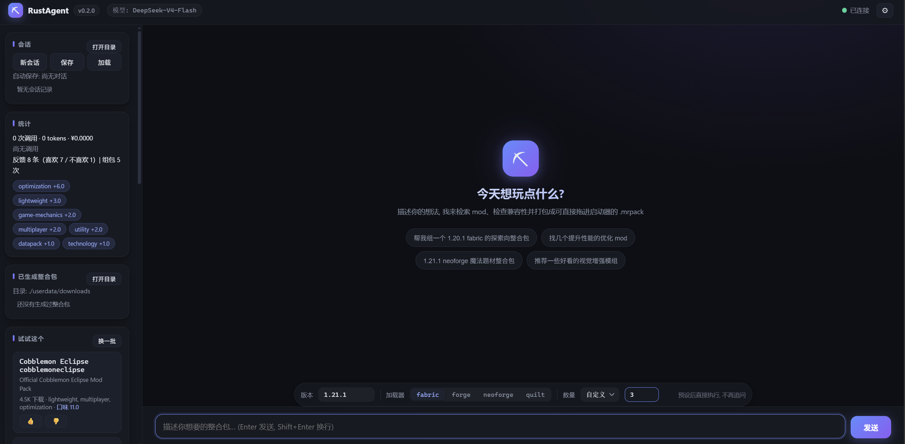

# RustAgent

一款用 Rust 编写的 **Minecraft 模组管理 Agent**：你用自然语言描述想要什么（版本、加载器、玩法偏好），它替你去 Modrinth 搜索、筛选、组包，最后生成一个可以直接拖进启动器（如 PCL2）安装的 `.mrpack` 整合包文件。

<div align="center">
  
</div>

## 它解决什么问题

- **找 mod 靠大海捞针**：现有整合包玩腻了，不知道还有什么好玩的 mod。RustAgent 根据你的口味描述自动搜索并给出候选清单，你只负责挑选。
- **组包兼容性地狱**：手动一个个检查版本、加载器、前置依赖非常低效。RustAgent 生成整合包时自动解析每个 mod 的依赖闭包，并基于元数据检测潜在冲突后汇报。
- **越用越懂你**：你对 mod 的喜欢/不喜欢会记入用户数据库，之后每次推荐都会按你的口味排序，还会主动"试试这个"推荐你没见过的新 mod。

## 核心功能

1. **智能搜索与组包**：描述需求（如"1.21.1 fabric 生存整合包，带点探索和装饰"），agent 调用 Modrinth API 搜索真实存在的 mod（绝不凭记忆瞎编），列出候选供你筛选，确认后自动补全前置依赖并生成 `.mrpack`。
2. **用户口味数据库**：你对 mod 的喜欢/不喜欢反馈持续累积为标签权重（`userdata/userdata.db`），每次组包的记录也会入库，推荐随使用越来越精准。
3. **"试试这个"**：根据你的口味画像，从 Modrinth 最新/热门 mod 中挑出你没评价过的新 mod；Web 界面侧栏有专属卡片，带 👍/👎 按钮直接写库，且与对话并行互不阻塞。
4. **版本过滤与冲突检测**：按游戏版本、加载器自动过滤不兼容 mod；组包支持 fabric / forge / neoforge / quilt 四种加载器（各加载器最新稳定版从官方元数据实时获取并写入整合包依赖声明）；组包时检测冲突风险并汇报。
5. **整合包修复**：把启动器报错（如"缺少 xxx 依赖"）贴给它，agent 自动找到缺失 mod 并补进原整合包，重新拖入启动器即可。
6. **CurseForge 独占 mod（实验性，默认关闭）**：在 `config.toml` 中加入 `[curseforge]` 并设置 `enabled = true` 即可开启；开启后部分 CurseForge 独占的经典 mod 也能点名加入整合包。
7. **灵活的 LLM 接入**：任何 OpenAI 兼容 API（DeepSeek、OpenAI 等）或本地部署模型（如 Ollama）均可，只需改配置文件；支持透传思考模式参数（如 `reasoning_effort`、`enable_thinking`）。

## 快速开始

### 环境要求

- [Rust](https://rustup.rs/) 1.70+
- 一个 LLM API Key（OpenAI 兼容接口），或本地 Ollama 等

### 安装与配置

```bash
git clone <本仓库地址>
cd RustAgent
copy config.example.toml config.toml   # Linux/macOS 用 cp
```

编辑 `config.toml`，填入你的 API 信息：

```toml
[llm]
base_url = "https://api.deepseek.com/v1"   # 任意 OpenAI 兼容端点
api_key = "sk-xxxx"                        # 换成你的 key
model = "deepseek-chat"
context_length = 32768                     # 上下文长度
price_input_per_m = 0.27                   # 输入 token 单价 (元/百万)
price_output_per_m = 1.1                   # 输出 token 单价 (元/百万)
token_budget = 2000000                     # token 预算, 用完自动中断
max_tool_iterations = 16                   # 一轮对话最多工具调用次数, 复杂组包需求可调大
# thinking = "reasoning_effort=medium"     # 思考模式: auto/省略=不发送; 也可透传 enable_thinking=false 等参数

[output]
download_dir = "./userdata/downloads"      # 整合包输出目录 (用户数据根目录下)

[database]
path = "./userdata/userdata.db"            # 用户数据根目录 = 本文件父目录: 数据库/会话/整合包都在里面

[ui]
port = 1780                                # Web 界面端口 (cargo run -- ui)
```

### 启动方式

RustAgent 有三种使用方式，配置只需做一次，按需选择：

**方式一：命令行交互模式（开发/调试常用）**

```bash
cargo run
```

进入交互式终端后直接对话即可，界面采用仿 opencode / claude code 风格：圆角边框横幅、`❯` 提示符（激活预设时显示标签）、工具调用彩色状态行；回复流式逐字输出（打字机效果），组包等长任务带 ▰▱ 进度条实时刷新，超 3 秒的操作有"仍在执行…"兜底提示，随时 `Ctrl+C` 打断。示例：

```
╭──────────────────────────────────────────╮
│ ⛏ RustAgent v0.2.0 · 测试版              │
│ 模型 deepseek-chat · mod 数据来自 Modrinth│
╰──────────────────────────────────────────╯
❯ 我想要 1.21.1 fabric 的生存整合包, 带点探索和装饰内容
```

agent 会先展示候选 mod 列表（含推荐理由和下载量），你确认后它才下载并生成整合包，输出路径会直接打印在终端。

**方式二：Web 界面模式**

```bash
cargo run -- ui
```

启动后浏览器自动打开本地 Web 界面（默认 http://127.0.0.1:1780，端口在 `config.toml` 的 `[ui]` 段配置）。界面功能详见下方 [Web 界面](#web-界面) 章节。

**方式三：双击桌面图标（不想每次启动碰命令行）**

配置完成后日常只需双击桌面图标即可进入 Web 界面，全程不碰命令行。

1. **构建主程序**（一次性）：打开项目文件夹，在地址栏输入 `powershell` 回车，执行：

   ```powershell
   cargo build --release
   ```

   完成后 `target\release\rustagent.exe` 就是主程序（约 9 MB）。
2. **创建桌面快捷方式**（一次性）：

   1. 右键 `target\release\rustagent.exe` → **发送到** → **桌面快捷方式**；
   2. 右键桌面上新生成的快捷方式 → **属性**，修改两处：
      - **目标**：在 exe 路径末尾补一个空格再加 `ui`（形如 `...rustagent.exe" ui`）；
      - **起始位置**：改为项目根目录（如 `D:\code\RustAgent`）——漏了这步会报"找不到 config.toml"；
   3. 想要专属图标：属性 → **更改图标** → 浏览选择项目里的 `assets\icon.ico`。
3. **日常使用**：

   - 双击图标 → 弹出控制台窗口（显示服务器日志，**关闭窗口即退出**）→ 浏览器自动打开 Web 界面（http://127.0.0.1:1780）；
   - 在输入框用中文描述需求，确认候选 mod 列表后自动生成整合包；
   - 打开 `userdata\downloads\` 目录，把 `.mrpack` 拖进 PCL2 等启动器即可游玩；
   - 所有数据都在 `userdata\` 文件夹里，整个删掉即可完全重置。

## 交互命令

| 命令       | 作用                                                                                                                              |
| ---------- | --------------------------------------------------------------------------------------------------------------------------------- |
| `/set`   | 会话预设:`/set 版本=1.21.1 加载器=fabric 数量=10`，之后每条消息自动注入预设，agent 不再追问；数量单次对话上限 20                |
| `/new`   | 开启新会话（清空当前上下文）                                                                                                      |
| `/save`  | 手动另存一份会话快照到`userdata/sessions/`（含对话、token 用量，JSON 格式）；每轮对话结束后也会**自动保存**，无需手动操作 |
| `/load`  | 加载最近一次保存的会话（之后继续对话会**原地续写**该文件，不再另存新文件）                                                  |
| `/stats` | 查看用户口味数据库、标签权重与本次会话用量统计                                                                                    |
| `/quit`  | 退出                                                                                                                              |
| `Ctrl+C` | 打断当前正在执行的任务（不会退出程序）；打断在工具执行内部同样秒级生效                                                            |

## 子命令

```bash
cargo run -- selftest                 # 不耗 LLM token 的自检: 测试 Modrinth 搜索、四种加载器版本获取与组包、校验 .mrpack 格式
cargo run -- demo                     # 无 LLM 的组包逻辑演示 (手动输入版本/加载器/主题)
cargo run -- demo trythis             # 无 LLM 的"试试这个"推荐演示
cargo run -- ui                       # 启动 Web 界面 (默认 http://127.0.0.1:1780, 自动打开浏览器)
cargo run -- repair "{\"pack_name\":\"包名\",\"add_slugs\":[\"sodium\"]}"  # 向已生成的整合包补入指定 mod
```

## Web 界面

运行 `cargo run -- ui` 后，浏览器会自动打开本地 Web 界面（端口在 `config.toml` 的 `[ui]` 段配置，默认 `1780`）：

- **聊天区**：与 CLI 同一套 Agent 对话，支持**流式输出**——回复逐字打出（打字机效果，不再等整个响应）；工具调用实时可见，组包时的实时进展带 ▰▱ 进度条（如"⏳ ▰▰▰▱… 3/8 正在收集 mod sodium"，同一行原地刷新）；LLM 思考期间也有实时反馈（"思考中 (Ns)" / "模型思考中… (Ns)"），全程不再是黑盒等待。若模型支持思考模式，还能点"显示思考"实时查看推理过程。多轮工具调用时，每段回复与工具调用行保持清晰的上下顺序（文本 → 工具行 → 文本 → … → 最终回复），不会互相穿插。
- **超 3 秒必有反馈**：任何执行超过 3 秒的工具，系统自动周期提示"xx 仍在执行… (Ns)"兜底，保证长任务永远有实时反馈；组包/修复类长任务内部每步都上报进展，且可随时打断。
- **任务打断**：Agent 执行期间（模型思考 / 组包收集等长任务）输入区会出现红色"⏸ 打断"按钮，点击即安全中止当前任务——打断对**工具执行内部**同样生效（每个 mod 收集间隙响应，秒级停止），已产生的对话上下文保持合法，随时可以继续下一轮。
- **预设选项栏**：输入框上方的胶囊工具栏可固定选择 MC 版本、加载器（fabric / forge / neoforge / quilt 分段按钮）与找包数量（5/8/10/15/20 或自定义，单次对话上限 20，自动记忆），随每条消息一并发给 agent，省去"你想要什么版本"的追问，少花一轮 API 调用。单包用户所选 mod 上限 100 个（前置依赖自动补全与报错修复补入不计入）—— 为考虑轻量化，敬请谅解。
- **整合包管理**：侧栏列出已生成的 `.mrpack`，点"打开目录"按钮直接在文件管理器中打开输出文件夹，拖进启动器即装。
- **会话管理**：对话**边进行边自动保存**到 `userdata/sessions/auto-*.json`（发出消息即建文件，每个工具结果后落一次盘，轮末再完整保存一次）——即使中途打断、出错甚至程序崩溃，已产生的内容也不丢；同一会话固定覆盖写同一文件，会话卡片显示当前自动保存文件。侧栏可新会话/另存快照/加载，会话记录列表点击即导入并完整渲染历史对话（合法文件才可导入）；也可打开 sessions 目录手动放入会话文件导入。**对话进行中也可直接切换会话**（新会话/加载/点击历史记录）：当前轮会自动打断收尾并保存，无需等待回答完毕；从历史记录接着聊会原地续写那个文件，不会重复另存。
- **"试试这个"卡片**：根据你的口味画像推荐 5 个没评价过的新 mod（点"换一批"刷新），每项带 👍/👎 按钮直接写入口味数据库；该卡片独立于对话，对话进行中也能点推荐/反馈，互不阻塞。
- **侧栏统计**：token 用量统计含每次 API 调用实时显示（"上次调用 · 输入/输出/合计"）与累计用量；用户口味标签权重可视化；可用工具列表与已生成整合包列表一目了然。
- **设置窗口**：顶栏 ⚙ 按钮随时打开，可运行时修改模型、API 地址、API Key（脱敏显示、留空保持不变）、上下文长度、token 预算、单价、工具调用上限与思考模式参数；保存后**立即热生效**（当前会话与上下文保留，无需重启），同时自动写回 `config.toml`（保留你的注释）。
- **界面视觉**：深色渐变 + 玻璃拟态风格；欢迎页提供可一键填入的示例需求，消息带双方头像，工具调用以彩色胶囊展示，宽屏下对话保持舒适阅读宽度。
- 界面以静态三件套（HTML/CSS/JS）内嵌进二进制，单文件即可分发，无需额外部署前端。

## 生成物说明

| 路径                            | 内容                                                                                         |
| ------------------------------- | -------------------------------------------------------------------------------------------- |
| `userdata/downloads/*.mrpack` | 整合包文件，可直接拖入 PCL2 等启动器安装                                                     |
| `userdata/userdata.db`        | 用户口味数据库（反馈记录、标签权重）                                                         |
| `userdata/sessions/*.json`    | 会话存档（完整上下文 + token 用量；`auto-*` 为每轮自动保存，`session-*` 为手动另存快照） |

所有运行时产物集中在 `userdata/` 一个文件夹内（根目录为用户数据目录，由 `config.toml` 的 `[database] path` 父目录决定）；删掉整个 `userdata/` 即可完全重置。

## Agent 背后的工具

agent 通过函数调用（tool calling）驱动以下工具，所有 mod 数据均来自 Modrinth 真实 API，不依赖模型记忆：

- `search_mods` — 搜索 mod（支持中文关键词自动翻译、版本/加载器过滤）
- `build_modpack` — 组包：解析依赖闭包、检测冲突、生成 `.mrpack`（支持 fabric / forge / neoforge / quilt）
- `record_feedback` — 记录喜欢/不喜欢
- `get_user_profile` — 读取口味画像用于个性化推荐
- `recommend_new_mods` — "试试这个"推荐
- `repair_pack` — 向已有整合包补入缺失 mod

## 项目结构

```
src/
├── lib.rs        # 库入口: 模块组织 + prelude (anyhow/serde/Arc 等高频导入集中)
├── main.rs       # 二进制入口: 子命令分发 (selftest / demo / ui / repair)
├── selftest.rs   # selftest 子命令: 不耗 LLM token 的自检 (真网访问 Modrinth)
├── cli.rs        # CLI: 交互式 REPL 主循环 + 圆角横幅、ANSI 配色、CJK 宽度对齐、进度条
├── agent/        # Agent 主循环: LLM 对话、工具调度、上下文裁剪、预算、打断与进展
│   ├── mod.rs
│   └── prompt.rs # 系统提示词
├── llm.rs        # OpenAI 兼容 LLM 客户端 (含 tool calling 与流式输出)
├── providers/    # 外部 mod 平台客户端
│   ├── modrinth.rs   # Modrinth API (主数据源)
│   └── curseforge.rs # CurseForge 点名 (实验性)
├── tools/        # 工具注册表: 基础设施 (进展/打断) + 各工具实现
│   ├── mod.rs        # TaskCtx / ToolRegistry / 工具 defs 与分发
│   ├── search.rs     # search_mods
│   ├── build.rs      # build_modpack
│   ├── repair.rs     # repair_pack
│   ├── feedback.rs   # record_feedback / get_user_profile / recommend_new_mods
│   └── loader_meta.rs # 四加载器版本获取与依赖键名
├── pipeline.rs   # 纯逻辑管线: 排序、口味标签、依赖闭包 (可脱离 LLM 演示)
├── storage/      # 持久化
│   ├── database.rs   # 用户口味数据库 (SQLite)
│   └── history.rs    # 会话保存/加载 (含轮内检查点自动保存)
├── config.rs     # config.toml 解析、启动校验与设置写回
└── ui/           # Web 界面: axum 服务器 + REST/流式 API + 内嵌前端三件套

userdata/          # 运行时用户数据 (首次运行自动创建)
├── userdata.db    # 口味数据库
├── sessions/      # 会话存档
└── downloads/     # 生成的 .mrpack
```

## License

见 [LICENSE](LICENSE)。
